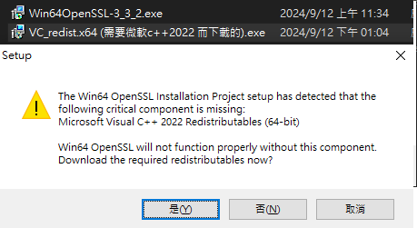
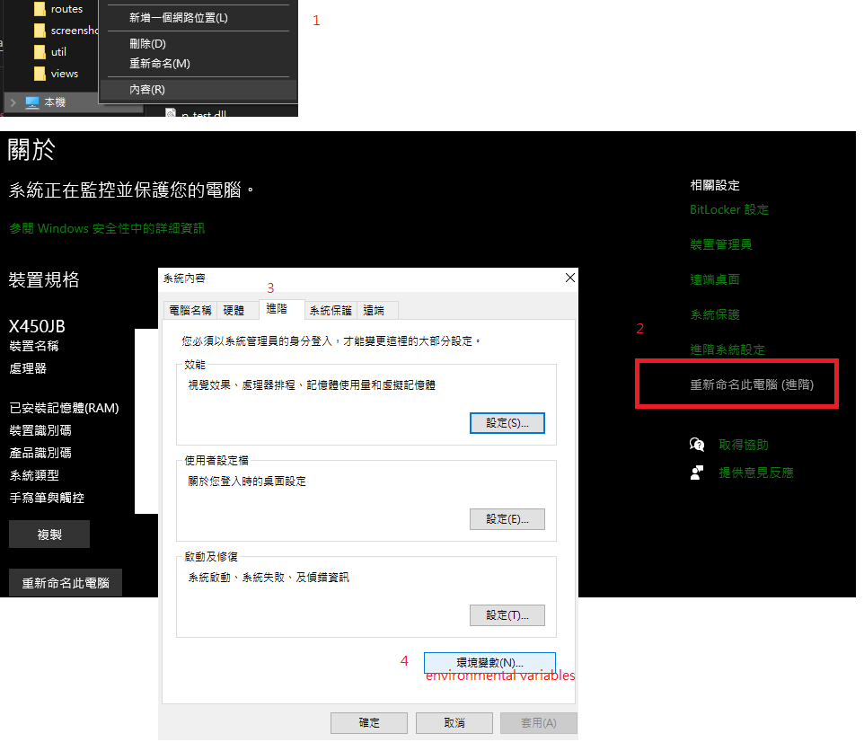
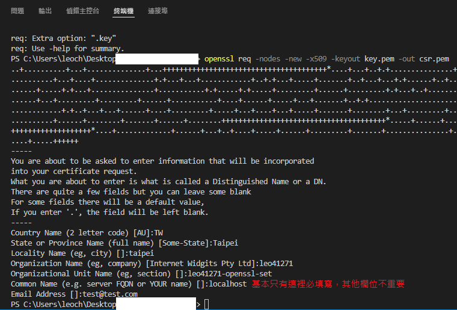
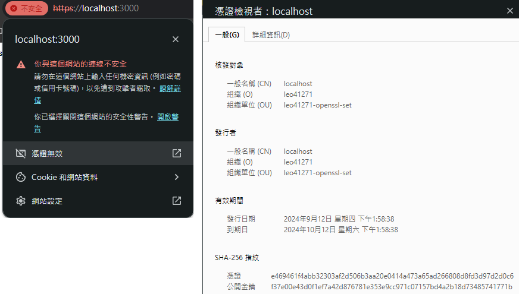

# 如何在 node.js express 下設定 SSL (TLS) 憑證 教學

## SSL TLS 運作機制
TLS 為新一代的SSL ， 但現今大家還是習慣稱呼 TLS 為SSL。  
通信間為了 資料的安全性 我們會將其加密。  
所以為了要知道通信資料，我們會需要解密，故 後端我們會有 公鑰 私鑰。  

公鑰顧名思義，不用保護，私鑰永遠只有伺服器知道，    
因為私鑰稍後將被用來解密資料，公鑰將用於加密。  
現在在ssl憑證中，我們將該公鑰綁定到伺服器身份，  
身分是網域名稱、管理員電子郵件地址之類的東西、當您在設定憑證時所設定的內容。  
ssl憑證會連接公鑰和伺服器 並發送該證書 到前端、到瀏覽器，  
以便客戶端(client)也知道公鑰並知道它屬於到該伺服器。  
通常您將使用機構頒發憑證，但我們也可以自己建立 ssl 憑證。  
但創建自己的密鑰時，瀏覽器實際上並不相信您那裡的信息是正確的(會是SSL 但資訊不信任)，  
你可能會看到"嘿此頁面使用ssl 但似乎不安全"之類的資訊或警告。  
因此，在生產中，您將使用已知憑證機構頒發所提供的 ssl 憑證並且被瀏覽器信任。  
但兩者基本運作方式是相同的。  
理想下憑證會由受信任的機構創建。  
我們擁有該公鑰，該證書的一部分，我們將在這裡自己創建它，因為這是免費的，  
然後客戶端透過該憑證接收該公鑰，現在客戶端可以加密它發送到伺服器的數據，伺服器可以使用該私鑰解密數據，並且只有該私鑰才能解密該數據。  

## windows 下載流程與設定

MAC Linux 有預設的所以不用下載， windows 沒有。
1. windows 需要自己下載。\
[openSSL Binaries](https://wiki.openssl.org/index.php/Binaries) > `OpenSSL for Windows`
[Win32/Win64 OpenSSL Installer for Windows](https://slproweb.com/products/Win32OpenSSL.html)\
2. download VC_redist.x64 for C++ (if you don't have click yes(是) if you have it will not show)\
如果電腦沒下載 c++ 牠會發出警告需要下載才能安裝 openssl ，點擊是 會跳到網頁自動幫你下載 `VC_redist.x64` 完成後執行安裝。再回來執行 OpenSSL 安裝檔。
安裝檔都預設即可。

3.  下載後 cmd 裡面 openssl 還未被加到環境變數裡面。找到 openssl bin 所在的檔案目錄例如以下 `C:\Program Files\OpenSSL-Win64\bin` 將其加到環境變數中。
4. go to ENV_VAR

5. set openssl to path\

6. click ok ... ok ... ok.設定好後 記得都按下確定....
7. go to cmd test `openssl version` (vscode need to close and reopen) 測試是否有 openssl 指令(vscode 需要完全重新啟動)
```cmd
C:\Users\leoch>openssl version
OpenSSL 3.3.2 3 Sep 2024 (Library: OpenSSL 3.3.2 3 Sep 2024)
```
8. generate_key  
[openssl syntax 語法](https://docs.openssl.org/master/man1/openssl-req/) 參看此。
```bash
# mac 的應該是如下(我是windows， mac 的我沒有很確定但可以試試)
openssl req -nodes -new -x509 -keyout -server.key -out server.cert
# windows 的應該是如下(我是windows)
openssl req -nodes -new -x509 -keyout key.pem -out csr.pem

### 其中 Common name 需要設定成你的域名 在這裡我們是 localhost 否則 將不會被接受
```
\

\
點擊無效憑證 查看詳細內容 可以看到 先前不重要的設置的訊息。
但因為我們自己設定的 不被瀏覽器信任所以網頁看到是不安全(我們不是被信任的第三方權威機構所認證，所以自己設定了也沒用)但技術上我們是確實有SSL憑證(加密方式為SHA-256)只是不受信任。  


<hr />

參考資料 reference:
+ openssl:  
https://docs.openssl.org/3.2/man7/ossl-guide-introduction/  
https://github.com/trulymittal/ssl-secured  
https://www.youtube.com/watch?v=cBa87N_BZ4s  
https://www.youtube.com/watch?v=USrMdBF0zcg&t  

+ node 裡面的環境變數 設定(可參看 git commit 紀錄第二個)(node 版本要20以上) > https://nodejs.org/en/learn/command-line/how-to-read-environment-variables-from-nodejs